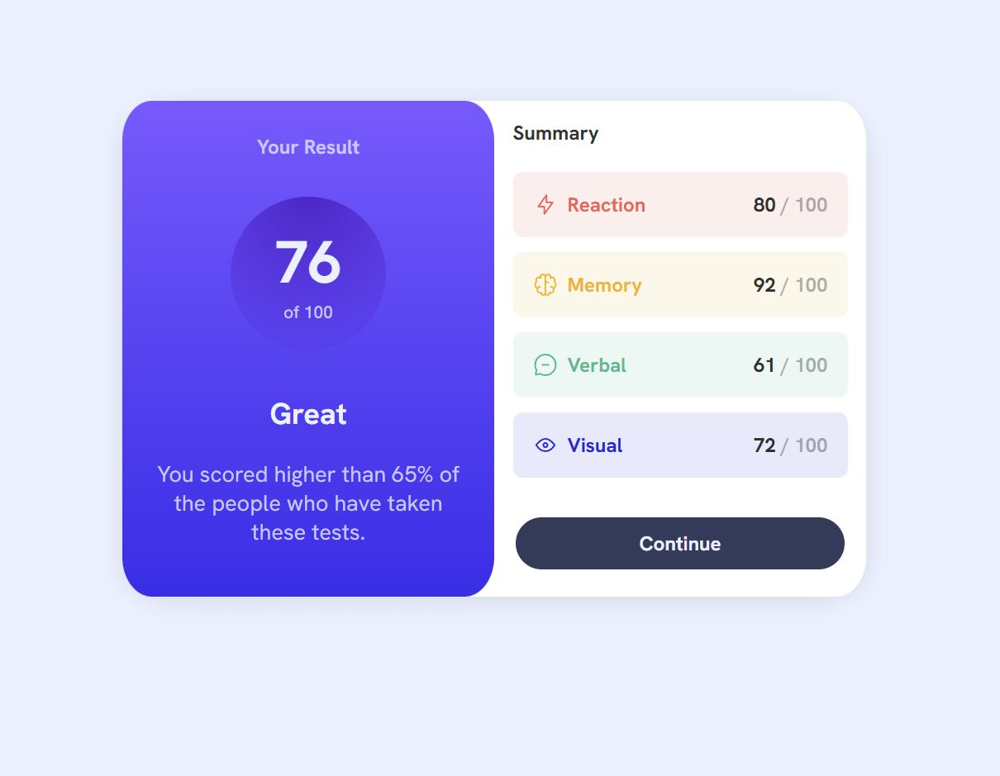
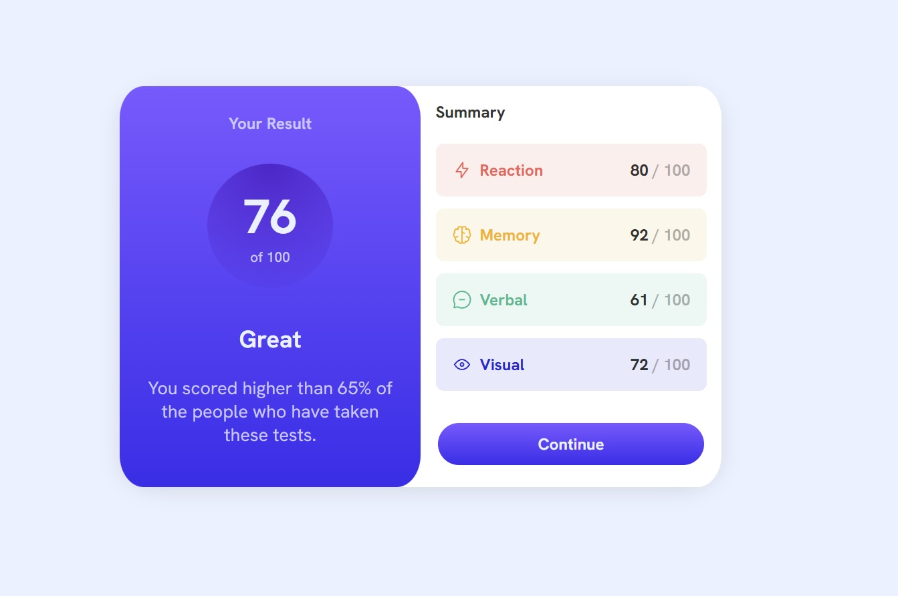
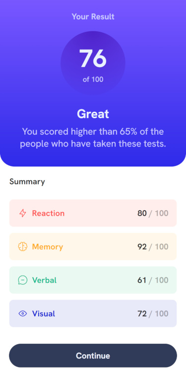

# Frontend Mentor - Results summary component solution

This is a solution to the [Results summary component challenge on Frontend Mentor](https://www.frontendmentor.io/challenges/results-summary-component-CE_K6s0maV). Frontend Mentor challenges help you improve your coding skills by building realistic projects. 

## Table of contents

- [Overview](#overview)
  - [The challenge](#the-challenge)
  - [My Solution Screenshots](#my-solution-screenshots)
  - [Links](#links)
- [My process](#my-process)
  - [Built with](#built-with)
  - [What I learned](#what-i-learned)
  - [Continued development](#continued-development)
- [Author](#author)

## Overview

### The challenge

<i>The Original - Desktop Design:</i>
  


<i>The Original - Active States:</i>
  


<i>The Original - Mobile Design:</i>

<p align="center">
  
</p>

Users should be able to:

- View the optimal layout for the interface depending on their device's screen size
- See hover and focus states for all interactive elements on the page
- **Bonus**: Use the local JSON data to dynamically populate the content

### My Solution Screenshots

------------

<i>Screenshot for the desktop design:</i>  
  


<i>Screenshot for the active states:</i>  
  


<i>Screenshot for the mobile design:</i>  
  
<p align="center">
  
</p>

### Links

- Live Site URL: [github pages](https://hannalysis.github.io/front-end-mentor-results-summary-component/)

## My process

### Built with

<p>
  <a href="https://skillicons.dev">
    
  </a>
</p>

### What I learned

Being my second Front End Mentor CSS challenge, I wanted to utilise this as practice implementing good class naming conventions, sensible container layouts, appropriate font styling and colour re-use with CSS custom properties. 

I also wanted to make this a mobile-first workflow, so styles are created for those dimensions foremost, and media queries are applied to larger devices (including desktop).

<h5><u>Main Challenge</u></h5>

- Planned out and implemented containers for all content
- Implemented CSS grid for mobile and desktop design
- Utilised and implemented the gradient styling for the results container
- Styled the card view on desktop, and adjusted the containers shaping on mobile
- Summary sub sections styled under a unified class, with separation for the individual colours for each sub section
- Active states implemented and final spacing tweaks

<h4><u>Code snippets of note</u></h4>

One of the few areas where I utilised nested CSS, but it worked for readability and with the separation of classes here, and it's clear what container and sub container this is pointing to.

```css
.section-container.green {
    background-color: hsl(166, 100%, 37%, 0.1);
    .verbal {
        color: var(--light-green);
    }
}
```
My first time utilising a responsive CSS grid, I wish I had more reason to explain why I'm proud of it, nevertheless it brings me joy and I'm looking forward using this more in future projects.

```css
.results-summary-container {
    display: grid;
    grid-template-columns: 1fr;
    ...
}
@media (min-width: 768px) {
    .results-summary-container {
      grid-template-columns: 1fr 1fr;
      ...
    }
}
```

### Continued development

<h5><u>Update 1 - Completed 2025/08/13</u></h5>

- Completed the bonus objective: To utilise the JSON file to dynamically populate the summary content with JS.


## Author

Hannahry aka [Hannalysis](https://github.com/Hannalysis)
